# Grafana
Grafana is an open source metric analytics & visualization suite. It is most commonly used for visualizing time series data for infrastructure and application analytics but many use it in other domains including industrial sensors, home automation, weather, and process control. This integration extends the ability to alert the person on call to a group and pause or unpause an alert coming out of Grafana using out closed-loop integration. Check out the sweet video [here](https://youtu.be/Dj2sEaZzXi0).

# Pre-Requisites
* [Grafana](https://grafana.com/) version 4.4.3
* xMatters account - If you don't have one, [get one](https://www.xmatters.com)!

# Files
* [GrafanaAlert.zip](GrafanaAlert.zip) - Communication Plan containing the Inbound and Outbound integration with form templates

# How it works
An alert fires a webhook to the xMatters integration builder. The integration builder parses the incoming JSON and builds the event, then fires the event to notify the default recipients. Alternatively [subscriptions](http://help.xmatters.com/OnDemand/userguide/receivingalerts/subscriptions/howtousesubscriptions.htm) can be set up to notify the desired parties. From the alert, you can pause the alert in Grafana to investigate the issue. When the issue is fixed, you can resume the alerting rule.  

# Installation

## xMatters set up
1. Login as the integration user in xMatters and navigate to the Developer Tab. (NOTE: Make sure the integration user has **REST Web Services User** Role. Reference General Notes section on how to create API user in xMatters.
2. Import the [GrafanaAlert.zip](GrafanaAlert.zip) Steps to import a communication plan: [Here]( http://help.xmatters.com/OnDemand/xmodwelcome/communicationplanbuilder/exportcommplan.htm)
3. Enable the plan, click Edit and select "Integration Builder"
4. Click into the Inbound integration labeled "Inbound from Grafana" and navigate to the Script Editor on Step 5 on that screen
5. Insert your group recipient(s) where it says [INSERT GROUPS HERE]. 
<kbd>
  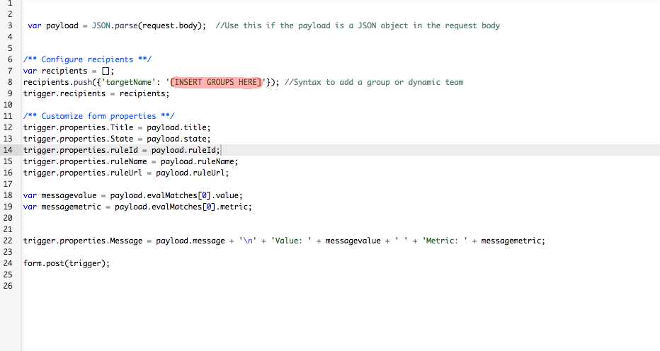
</kbd>

6. Save and return to the previous page. Click on "Update Inbound Integration" and copy the URL to have it handy later.
<kbd>
  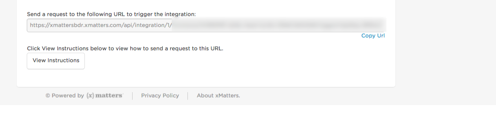
</kbd>

7. Close the "Update Inbound Integration" and return to the main page of the Integration Builder. On this main page, at the bottom are shared libraries. Select or edit the Grafana Library.
8. Insert the API Key you generated in Grafana into the code. Reference "General Notes" section on how to generate the API key 
<kbd>
  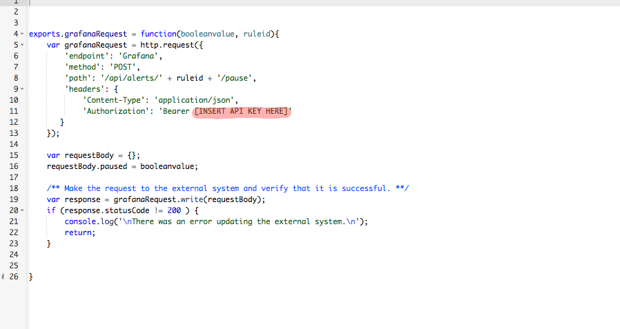
</kbd>
9. Add the Grafana Endpoint by clicking on "Edit Endpoints" in the Integration Builder. Add an endpoint and name it "Grafana". Add the URL to your Grafana instance. Make sure you save changes. 
<kbd>
  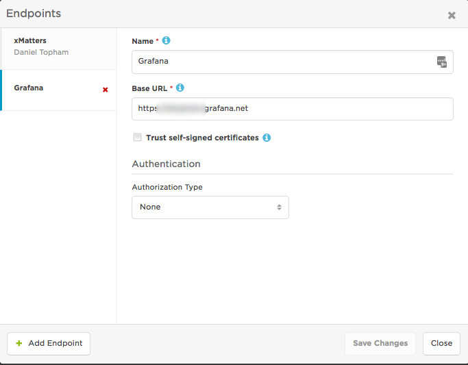
</kbd>

## Grafana set up
1. You first need to set up a notification channel in Grafana which can be found under the Alerting section
<kbd>
  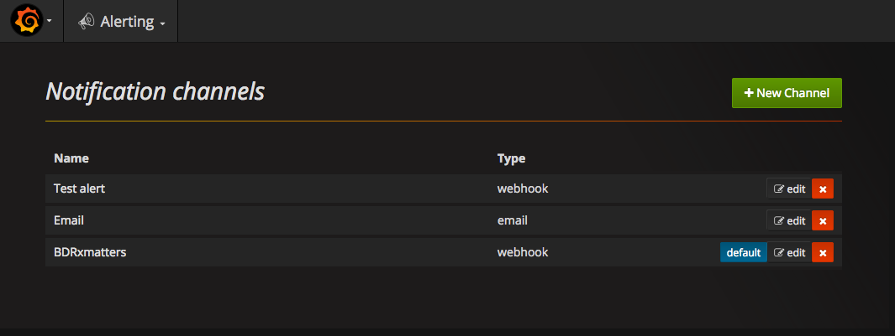
</kbd>

2. Click on "New Channel" and create a new webhook found under "type". Name it, set Http Method to "POST", set URL as the URL you saved. **Reference step 6 in the xMatters set up for the URL**. Your channel should look something like this. **NOTE: If you want to test out and see if the webhook works, you can click "Send Test" at the bottom.
<kbd>
  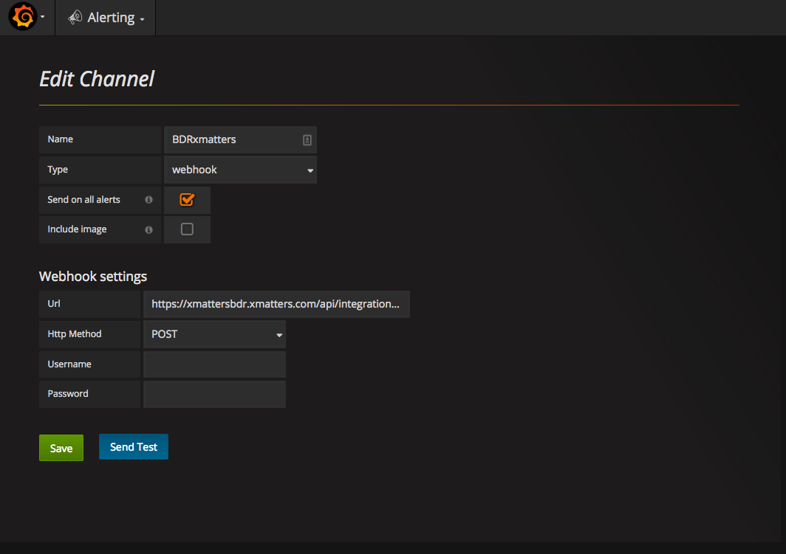
</kbd>

3. Go to the chart you want to be alerted on in Grafana, click "edit", click "Alert", then click "Notifications". Click the plus icon and add the Channel you just added in the previous step.
<kbd>
  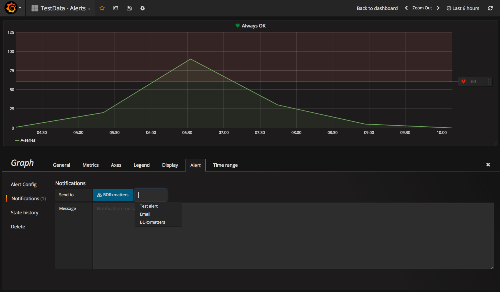
</kbd>

## General Notes
* How to set up the Grafana API Key to plug into xMatters. **PLEASE NOTE: Grafana will only show the API you created ONCE. Suggestion is to copy and paste it in a notepad somewhere so you can get to it if you ever need it again**
<kbd>
  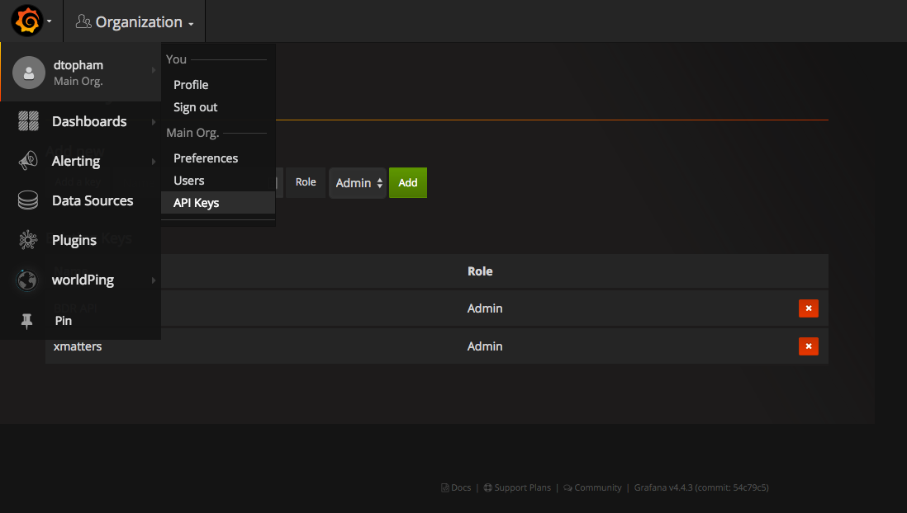
</kbd>

* How to create API User in xMatters
Click "Users", click "Invite Users" or "Add Users". Information should be something like this.
<kbd>
  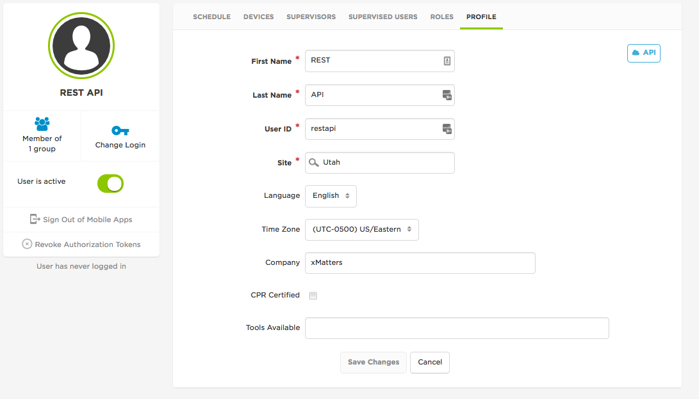
</kbd>
If it requires an email, the email can be something like email@xmatters.com 

# Testing
Do an action in your Gafana application or infrastructure that will trigger the alert conditions set up in the Alert. This will fire the webhook into the inbound integration builder script and an event will be created, targeting the default recipients. After it targets the right person, you can use our 2-way integration by responding with "Pause Alert" to pause the alerting process in Grafana. Once you fix the issue in Grafana, you can come back to the original xMatters alert and use the response option "Resume Alert" to resume the alerting rule.
<kbd>
  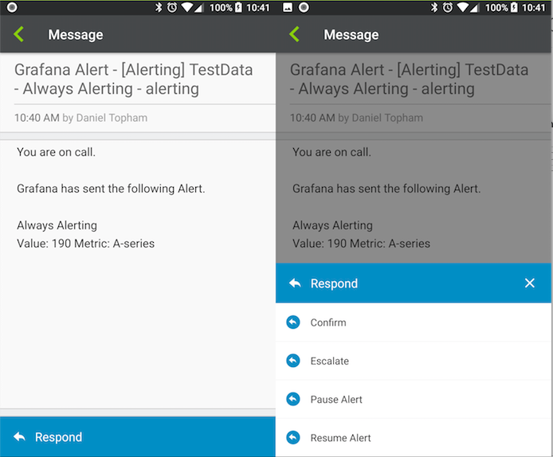
</kbd>

# Troubleshooting
 If it doesn't work, you can reference the "Activity Stream" of the integration. Please reference both screen shots to find the Activity Stream and what it should look like. You can look through the logs to see what the error is.

<kbd>
  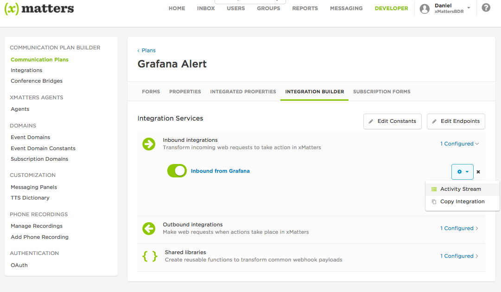
</kbd>

<kbd>
  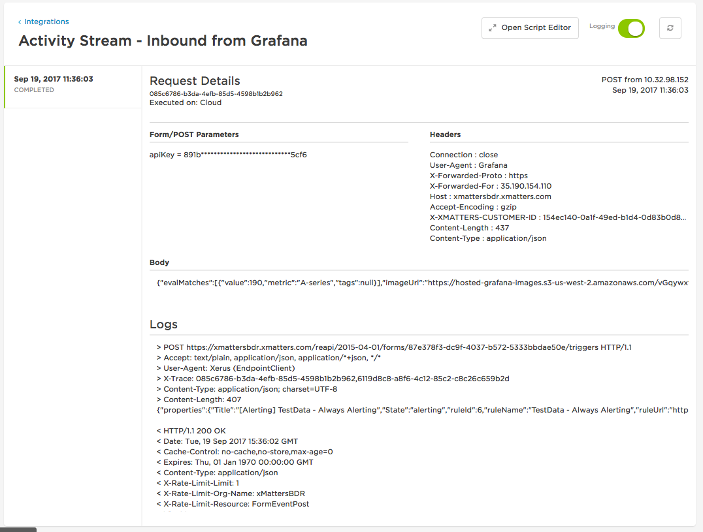
</kbd>
